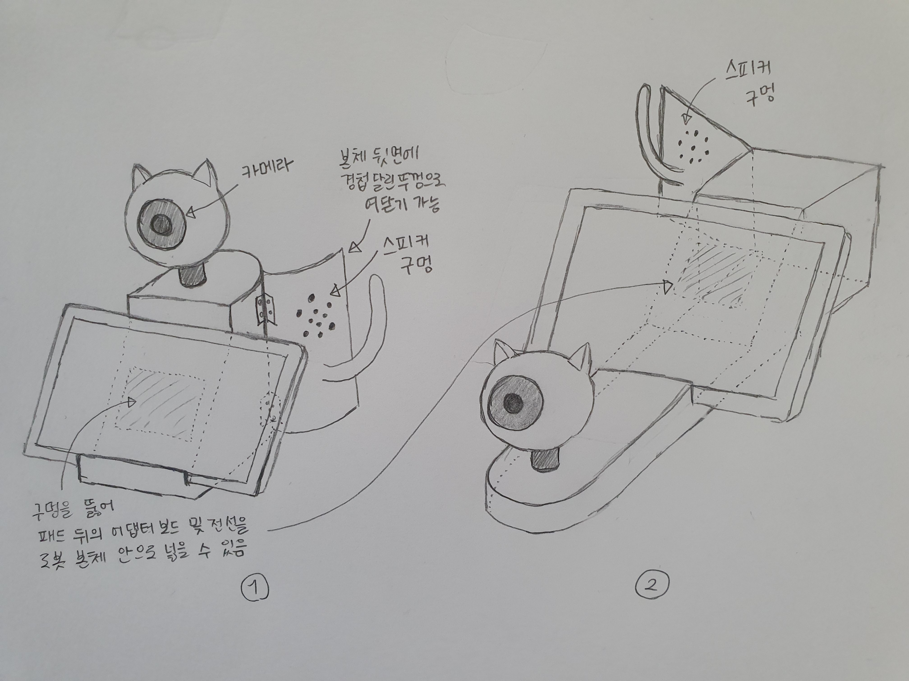
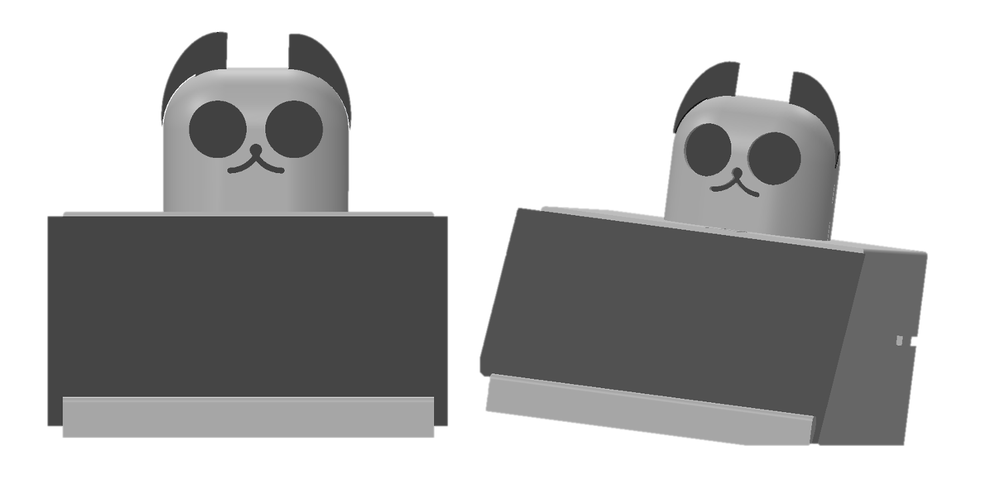

# Pet-CCTV-Robot
펫 자동 감지 CCTV
## Overview
  직장인들의 외출에 펫을 감시하기 위한 펫 CCTV, 하지만 기존 펫 CCTV는 사용자가 앱으로 직접 스트리밍 영상을 보면서 반려동물의 상황을 파악 해야하기 때문에 용무가 있어 외출을 한 사용자들에게는 스트리밍 영상을 통한 감시를 할 수 없는 상황이 대부분이다. 또한, 터치를 통해 구동되는 가전제품들이 증가함으로 반려동물의 사고 또한 빈번히 발생한다. 예로 반려동물 주인이 외출시 반려동물이 인덕션, 하이라이트 전자레인지 등을 건드려서 화재가 발생했다는 사건이 급증했다. ([화재사건기사내용](https://www.hankyung.com/life/article/201912041776Y)) 우리는 이에대해 기존의 제품이 구매자의 목적을 완벽하게 해소시켜주지 못한다는 점과 현재 사고들의 원인을 파악하여 사용자가 위험구역을 지정하고, 반려동물의 위치를 자동적으로 파악하여 기존 펫 CCTV의 부족한 점을 보완하고자한다.
 
## 세부 기능
- 사용자가 직접 본 기기 카메라에서 송출하는 화면을 통해 전면, 좌측, 우측 방향에 반려동물이 접근하면 안되는 구역을 설정을 할 수 있다.
- 본 기기는 인공지능을 통해 전면, 좌측, 우측 방향으로 반려동물의 위치를 파악한다.
- 반려동물이 사용자가 지정한 접근 금지 구역에 위치했을 때 기기는 음성을 송출하여 반려동물에게 제지를 하고, 사용자의 앱에 알림을 울린다. ([소리를 통해 반려동물을 제지할 수 있을까?](https://youtu.be/sFJ1QNv7OGw?t=42))

## 순차적 동작 개념 설명
1.	카메라에서 송출하고 있는 영상이 터치 스크린에 출력이 되고, 모터를 통해 움직이는 카메라의 각도(0도, 90도, 180도)별로 원하는 위험구역을 스크린에 터치한다.
2.	위험 구역 설정을 마무리하면, 카메라에서 촬영되고 있는 영상을 앱에 실시간으로 전송한다.
3.	5초 간격으로 모터를 돌려 카메라의 위치를 바꾼다. (이때 해당 카메라 각도로 설정한 위험구역을 불러온다.)
4.	고양이 / 강아지를 탐지한다.
5.	탐지한 고양이/ 강아지의 위치가 사용자가 설정한 위험구역 내에 위치할 경우 스피커로 음성 송출 및 사용자 앱에 알람을 송신한다.

## 사용재료
  라즈베리 파이3B+, 라즈베리 파이4, 라즈베리파이 카메라 모듈, USB허브, 서보모터, 마이크로 SD카드 32G, SD카드 리더기, 라즈베리파이 공식7인치 터치스크린

## 모델링
초기 모델 시안은 다음과 같다. 심미성 및 내부 하드웨어 위치를 고려하여 1번 구조를 택했으며, 이후에 하드웨어 크기를 고려하고, 3d 프린팅하기 쉬운 구조로 변형시켰다.

모델은 STL 파일로 첨부한다. 3D프린팅 편의를 위해 파트가 다음과 같이 분할되어 있다. 
```
.
├── cat_body_width_left.STL
├── cat_body_width_right.STL
├── real_cat_head_back.STL
├── real_cat_head_front.STL
└── real_cat_head_middle.STL
```
위의 파트들을 모두 합쳐 에셈블을 만들면 다음과 같다.


## 하드웨어 세부 구성
```
.
├── Google Edge TPU coprocessor : 인공지능 영상처리 가속화
├── raspberry pi 3 B+: 사용자에게 영상을 스트리밍 해줄 보드 
├── raspberry pi 4: 애완동물을 인식하여 위험구역을 탐지할 보드
├── arduino UNO: 모터를 제어할 보드
├── HS-311 servo motor: 카메라를 돌려줄 모터
├── SONY pi camera x 2: 카메라(하나는 애완동물 인식, 하나는 스트리밍용)
├── raspberry pi touch screen 7 inch: 사용자가 상호작용할 터치디스플레이
└── USB port speaker: 음성을 출력할 스피커
```

## 반려동물 감지 (detection)
파이카메라로 받은 영상을 Tensorflow-Lite와 OpenCV, Google의  sample TFLite model를 이용하여 고양이, 강아지, 새 등의 애완동물을 인공지능으로 학습하여 인식 가능하게 만들었다. 파이카메라로 영상을 받으면, 처음에 터치스크린을 터치하여 화면 상의 위험 구역을 선정한다. 그러면 화면 상에 고양이, 강아지 등 반려동물이 보이면 인공지능이 인식을 하고, 사용자가 선정한 위험 구역 범위에 인식된 반려동물의 좌표값이 들어오면 “Cat/Dog is danger!”라는 문구를 띄운다. 영상처리에서는 FPS를 개선하기 위해 TPU Accelerator를 사용하였으며, raspberry pi 3 B 에서 raspberry pi 4로 새로 교체하여 기존의 파이카메라로 영상처리를 할때 약 1~2 FPS였던 것을 약 30~40 FPS정도까지 끌어올려 부드러운 영상이 나오도록 했다. 
파일 실행 방법은 다음과 같다.
```
source tflite1-env/bin/activate
python3 TFLite_detection_webcam.py --modeldir=Sample_TFLite_model --edgetpu
```